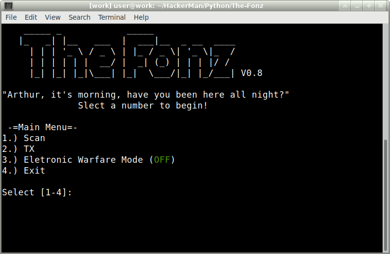

 # About
The Fonz, an "easyer" to use passive scanner and transmiter for the TouchTunes Jukebox (Gen 2 and above) wireless remote. TouchTunes remotes TX at 433.92Mhz, uses ASK/OOK, and uses a pin (000-255) for addressing. 
This script was meant to be used with RfCat and the Yard Stick One.

# Quick Start Guide

0.) pip install termcolor pyusb 

1.) git clone https://github.com/notpike/The-Fonz.git

2.) cd The-Fonz

3.) sudo ./The_Fonz.py

4.) Plug in the Yard Stick One

5.) Choose 'Scan' to listen for transmissions

6.) Input captured PIN into your own personal remote or use 'TX' to transmit commands

7.) Pocket your remote or cordinate with your wingman, Smack the jukebox while skiping that one Jusin Bieber song while saying, "AYEEE!!"

8.) Injoy your free drinks from your freinds :D

# Touch Tunes Info

- Frequency: 433.92MHz
- Modulation: ASK/OOK
- Protocol: NEC
- Symbol Rate: 1766
- Symbol Period: 566us

###### ==NEC Format==
- Short(0): 10 
- Long (1): 1000

- Structure:                 <SYNC> <PREAMBLE> <PIN> <COMMAND>
- Sync (Literal Symbols):    \xff\xff\x00
- Preamble (Decoded NEC):    0x5D
- PIN 000-255 (Decoded NEC): 0x00-0xFF (LSB)
- Command (Decoded NEC):

###### ==Comnds==
Note: Commands are doubled with the 2nd half being reversed. For example, Pause 0x32 will translate to 0x3223 before being encoded to the literal symbols. \xA8\x8A\x8A\xA2\xA8\x80

  - 0x32	// Pause
  - 0x78	// On/Off
  - 0x70	// P1
  - 0x60	// P2
  - 0x20	// F1
  - 0xF2	// Up
  - 0xA0	// F2
  - 0x84	// Left
  - 0x44	// OK
  - 0xC4	// Right
  - 0x30	// F3
  - 0x80	// Down
  - 0xB0	// F4
  - 0xF0	// 1
  - 0x08	// 2
  - 0x88	// 3
  - 0x48	// 4
  - 0xC8	// 5
  - 0x28	// 6
  - 0xA8	// 7
  - 0x68	// 8
  - 0xE8	// 9
  - 0x18	// Music_Karaoke
  - 0x98	// 0
  - 0x58	// Lock_Queue
  - 0xD0	// Zone 1 Vol+
  - 0x90	// Zone 2 Vol+
  - 0xC0	// Zone 3 Vol+
  - 0x50	// Zone 1 Vol-
  - 0x10	// Zone 2 Vol-
  - 0x40    // Zone 3 Vol-

- Command:             Pin 000 - On/Off
- Literal Symbols HEX: ffff00 a2888a2 aaaa 8888aa2aa2220
- Literal Symbols BIN: 11111111111111110000 10 1000 10 1000 1000 1000 10 1000 10 10 10 10 10 10 10 10 10 1000 1000 1000 1000 10 10 10 1000 10 10 10 10 1000 1000 1000 100000
- Decoded Symbols:             SYNC         S  L    S  L    L    L    S  L    S  S  S  S  S  S  S  S  S  L    L    L    L    S  S  S  L    S  S  S  S  L    L    L

# Versions
###### UPDATE V0.099999
  - Now uses the proper encoding and decoding methods the for NEC protocol! :D
  - Everything is better now!
  - No more recursion problems!
  - Check out The_Fonz.py for the new script!

###### UPDATE V0.8
  - Added Electronic Warfare Mode
  - Tatical Jamming inbetween transsmissions 
  - Stops unwanted signals from reaching the target while you still have full control over the juke box

###### UPDATE V0.7
  - Can be imported threw the iPython interface with RfCat.
  - import The_Fonz as f
  - f.MainMenu()

###### UPDATE V0.6
  - Cleaned up my code
  - Grouped the commands togeather for the Brute Force atack, %50 faster but not tested.
  - Plans: Add RTL-SDR and HackRF suport, Figure out Long TX's.

###### UPDATE V0.5
  - Removed redundant re-transmission in the Brute Force feature, ~20sec faster now.
  - Prints the TX codes during a Brute Force.

###### UPDATE V0.4
  - Added Brute Force feture! You now can try every PIN posability for 1 command. Enter in 999 for the PIN and you'll be able to brute force a command.
  - Improved menu, no longer bugs out when you enter the wrong choice.

###### UPDATE V0.3
  - Added TX feture! You now have a 'hopfully' working remote! (Not Tested Yet, Only compaired to the origional remote)
  - Improved PIN discovery so it only returns 1 answer

# More Info

http://productwarranty.touchtunes.com/download/attachments/1179814/900303-001-Remote%20Control%20User%20Guide-R01.pdf?version=1&modificationDate=1373656509000&api=v2

http://www.pressonproducts.com/t1-jukebox-remote-touchtunes-compatible/

https://fccid.io/2AHXI-T1

https://pastebin.com/Ue7UYAPg

Based off of Michael Osman's code. https://greatscottgadgets.com/

rflib and vstruct pulled from https://github.com/ecc1/rfcat

Ported to Portapack-Havoc by Furrtek https://github.com/furrtek/portapack-havoc

Written by NotPike, @IfNotPike
